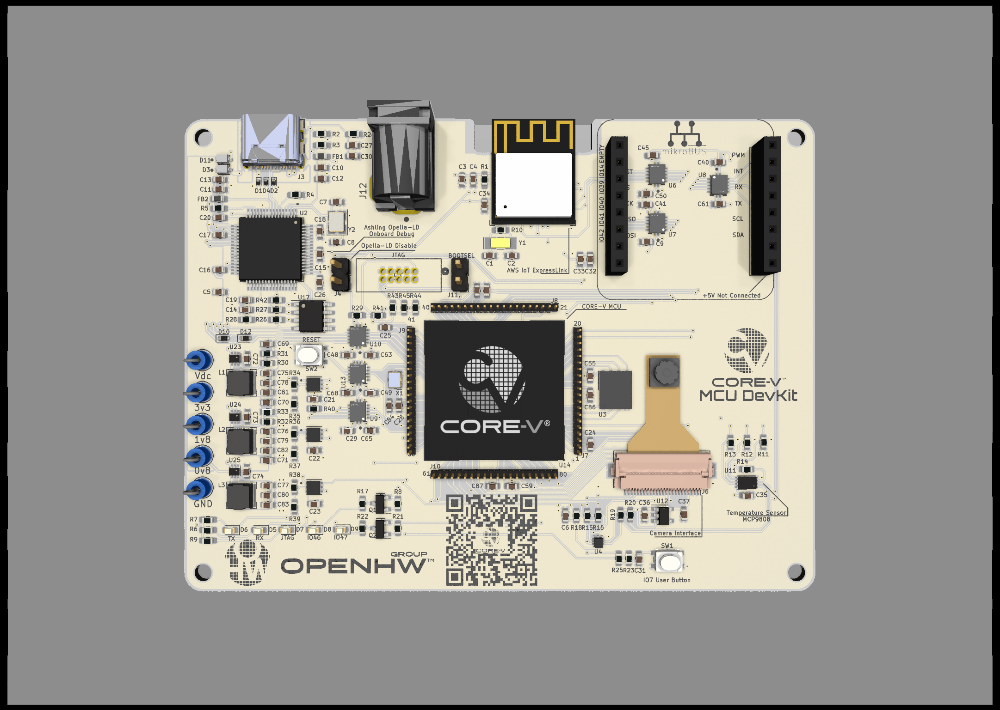
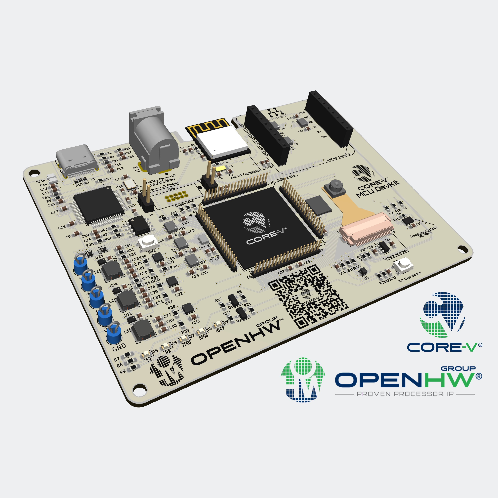

.. Copyright (c) 2023 OpenHW Group
   SPDX-License-Identifier: Apache-2.0 WITH SHL-2.1

   Level 1
   =======
   Level 2
   -------
   Level 3
   ~~~~~~~
   Level 4
   ^^^^^^^

.. _hardware-description:

CORE-V MCU DevKit Hardware Description
======================================

.. toctree::
    :caption: Table of Contents
    :maxdepth: 1

Feature List
------------

The CORE-V MCU DevKit includes these features:

- CORE-V MCU

	- CV32E40P processor core
	- Quicklogic ArticPro 2 eFPGA

- 4 MB flash memory
- Ashling Opella-LD onboard JTAG debug module
- USB-C for terminal and onboard debug access
- JTAG connector for external debug access
- Espressif AWS IoT ExpressLink Module for AWS IoT cloud interconnect
- mikroBUS onboard socket, allowing access to a vast range of mikroBUS modules
- Himax HM01B0 Ultralow Power CMOS Image Sensor
- I2C temperature sensor
- Several LEDs
- Reset button and general purpose button
- Dimensions 75 mm x 100 mm
- Power supply via USB-C or barrel connector (5V - 18V in)

Architecture diagram
--------------------

The figure below provides a block-diagram view of the DevKit.

.. figure:: ../images/OpenHW-Devkit-Block-Diagram.png
   :name: DevKit_Block_Diagram
   :align: center
   :alt: 

   DevKit Block Diagram

Board layout
------------

The DevKit board measures 75 mm x 100 mm.

The figure below provides a top elevation visualization of the DevKit

   DevKit Visualization (Top view)

The figure below provides a angle (isometric) elevation visualization of the DevKit

   DevKit Visualization (Angle view)

Component Description
---------------------

We review below the DevKits's main components and provide links for further information. 

CORE-V MCU 
~~~~~~~~~~

At the heart of the DevKit is the `CORE-V MCU <https://docs.openhwgroup.org/projects/core-v-mcu/doc-src/overview.html#purpose>`_, an ASIC developed by the OpenHW community and fabricated in `Global Foundry’s 22FDX process <https://gf.com/technology-platforms/fdx-fd-soi/>`_  The CORE-V MCU provides an evaluation and development platform for OpenHW’s fully-verified CV32E40PV1.0 embedded-class processor core. The CORE-V-MCU integrates the processor core with a set of on-chip peripherals, memory, and Quicklogic’s embedded FPGA (eFPGA) technology.  The CORE-V MCU logic, with the exception of the eFPGA, is available on `Github in open-source RTL <https://github.com/openhwgroup/core-v-mcu>`_ under the permissive Solderpad 2.1 license.

CV32E40PV1.0 Processor Core
^^^^^^^^^^^^^^^^^^^^^^^^^^^

The `CV32E40P processor core <https://docs.openhwgroup.org/projects/cv32e40p-user-manual/en/cv32e40p_v1.0.0_doc/intro.html>`_ is the first core released by OpenHW Group on Github in open-source RTL. It is a 4-stage, in-order 32-bit RISC-V processor core. The CV32E40P, developed through the collaborative efforts of the OpenHW community, is completely open-source and released under the permissive Solderpad 2.1 license. The ISA instruction set of of CV32E40P as instantiated within the CORE-V-MCU is shown `here <https://docs.openhwgroup.org/projects/cv32e40p-user-manual/en/cv32e40p_v1.0.0_doc/intro.html#standards-compliance>`_.

On-Chip Memory
^^^^^^^^^^^^^^

The CORE-V MCU includes 512K-byte of on-chip SRAM. The memory is organized as two 32K-byte banks of non-interleaved SRAM, typically used for program store, plus four 112K-byte banks of interleaved SRAM, typically used for data store. The interleaved memory architecture provides high speed access to memories for both the processor core and I/O peripherals.

On-Chip Peripherals
^^^^^^^^^^^^^^^^^^^
The CORE-V MCU includes the following peripherals:
2 UARTs
2 QSPI masters
2 I2C masters
1 SDIO
1 CI (Camera)
1 GPIO unit with 32 I/O
1 I2C slave
1 Advanced Timer (PWM) with 4 channels
JTAG

Embedded FPGA (eFPGA)
^^^^^^^^^^^^^^^^^^^^^
The embedded FPGA (eFPGA) subsystem integrated within the CORE-V MCU is based on `Quicklogic’s ArcticPro 2 architecture <https://www.quicklogic.com/products/efpga/arcticpro-2/>`_. This is a silicon-verified, production-proven eFPGA for MCU/SoC/custom ASIC applications. The eFPGA IP enables the flexibility to easily program custom functions, hardware accelerators and security algorithms after an SoC has been manufactured. Programming the eFPGA within CORE-V MCU will be supported by Open Source tools to create the bitstream. Example designs will be provided. 

CORE-V MCU DevKit Expresslink Module
~~~~~~~~~~~~~~~~~~~~~~~~~~~~~~~~~~~~
The CORE-V MCU DevKit includes `Espressif’s AWS IoT ExpressLink module <https://www.espressif.com/en/solutions/device-connectivity/esp-aws-iot-expresslink>`_ , which provides WiFi and out-of-the-box, seamless connectivity to the `AWS IoT ExpressLink <https://aws.amazon.com/iot-expresslink/>`_ cloud service. This allows DevKit-based IoT applications, such as the `OpenHW-developed temperature sensing demonstration <https://www.youtube.com/watch?v=lM74dSnQDpQ&ab_channel=OpenHWTVy6ggUH9IPfKmijGvwvBjuOFh>`_ to interconnect with AWS IoT cloud services.  

CORE-V MCU DevKit MikroBus Header
~~~~~~~~~~~~~~~~~~~~~~~~~~~~~~~~~
The CORE-V MCU DevKit includes a mikroBUS™ socket, comprising a pair of 1×8 female headers that support interconnection to a wide range of `display, sensor, actuator and other modules <https://www.mikroe.com/click>`_.

CORE-V MCU DevKit Debug Interface
~~~~~~~~~~~~~~~~~~~~~~~~~~~~~~~~~
The CORE-V MCU DevKit supports on-chip debugging of the CORE-V MCU via a JTAG interface and board connector. Additionally, the debug signals are converted to USB via the `Ashling Opella-LD debug probe <https://www.ashling.com/ashling-opella-ld/>`_ and brought out on USB-C.  

CORE-V MCU DevKit Flash Memory
~~~~~~~~~~~~~~~~~~~~~~~~~~~~~~
The CORE-V MCU DevKit provides a 4 MB flash memory used to store program code and other data. In the case of program code, a CORE-V MCU ROM-based bootloader loads the flash memory into the CORE-V MCU internal 512 KB SRAM.

CORE-V MCU DevKit Camera
~~~~~~~~~~~~~~~~~~~~~~~~
The CORE-V MCU DevKit supports a  `Himax camera (Ultra Low Power CMOS Image Sensor) <https://www.himax.com.tw/products/cmos-image-sensor/always-on-vision-sensors/hm01b0/>`_ connected to the CORE-V MCU via `Camera Serial Interface <https://en.wikipedia.org/wiki/Camera_Serial_Interface>`_ . The camera is mounted on a flex cable that allows the user to orient the camera in a variety of directions. 

CORE-V MCU DevKit Power Supply
~~~~~~~~~~~~~~~~~~~~~~~~~~~~~~
The CORE-V MCU DevKit includes a switching power supply which can accept 5V from the USB-C, or 5V - 18 V from the 2.1 mm barrel connector. 

Schematic
---------

The figure below provides a schematic for the DevKit.

.. figure:: ../images/OpenHW-DevKit-Schematics.pdf
   :name: DevKit_schematics
   :align: center
   :alt: 

   DevKit Schematics

Getting started with the DevKit
-------------------------------

Meant to go here: configuration of any jumpers and switches and connection of the power supplies etc. 

